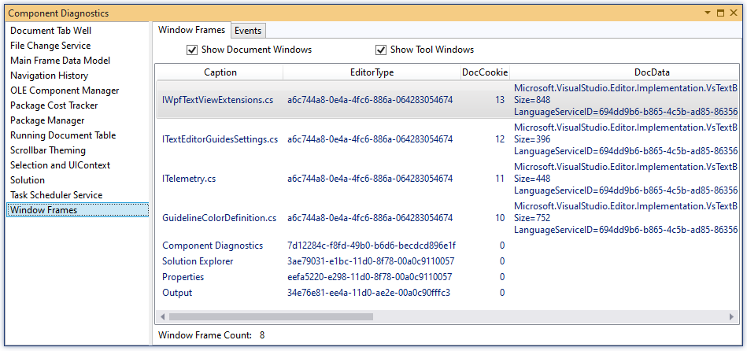

# ComponentDiagnostics
Explore internal real-time diagnostics from the running IDE

## Getting Started

Select the "Component Diagnostics" command from the "Help" menu to bring up the diagnostics tool window.

The Component Diagnostics tool window is divided into two panes. In the left hand pane is a list of all the registered diagnostics providers. New providers may be added in the future and other (non-Microsoft) extensions are free to add their own diagnostics providers to this list. The right hand pane shows the diagnostic information from the selected provider. Some views are just a property grid or a tree view over a simple data model. This is the minimal, default view for a diagnostic provider. Other providers include more advanced viewers to better visualize the internal workings of the selected component.

Diagnostics providers are implemented on several of Visual Studio's key services and the Component Diagnostics tool window gives you access to those providers.

The following providers are included:

- Document Tab Well
- **File Change Service**
- Main Frame Data Model
- **Navigation History**
- **OLE Component Manager**
- **Package Cost Tracker**
- **Package Manager**
- **Running Document Table (RDT)**
- **Scrollbar Theming**
- **Selection and UIContext**
- Solution
- **Task Scheduler Service**
- **Window Frames**

Bolded items have custom views for their providers. Non-bolded items use a default viewer where data models are presented either as a Property Grid or as a tree.

Note that the UI is more functional than beautiful. It's meant to be developer-level UI - not for end users. We decided early on during development that we would release this as an extension on the Marketplace instead of shipping it in the box - hence the lack of polish. However, the diagnostics capabilities of this tool are unmatched and many Visual Studio team members found it useful for debugging and tuning their extensions.

The Component Diagnostics feature is extensible, so components can add their own diagnostics providers and, moreover, they can replace the default property grid view with customized UI. For information on Component Diagnostics extensibility, see the IVsDiagnosticsProvider documentation.

If you are creating an extension for Visual Studio and you need help exposing your own diagnostics in this tool window, please enter an [issue](https://github.com/pharring/ComponentDiagnostics/issues) in GitHub and we'll try to help.
